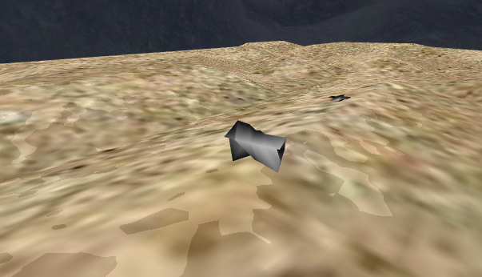
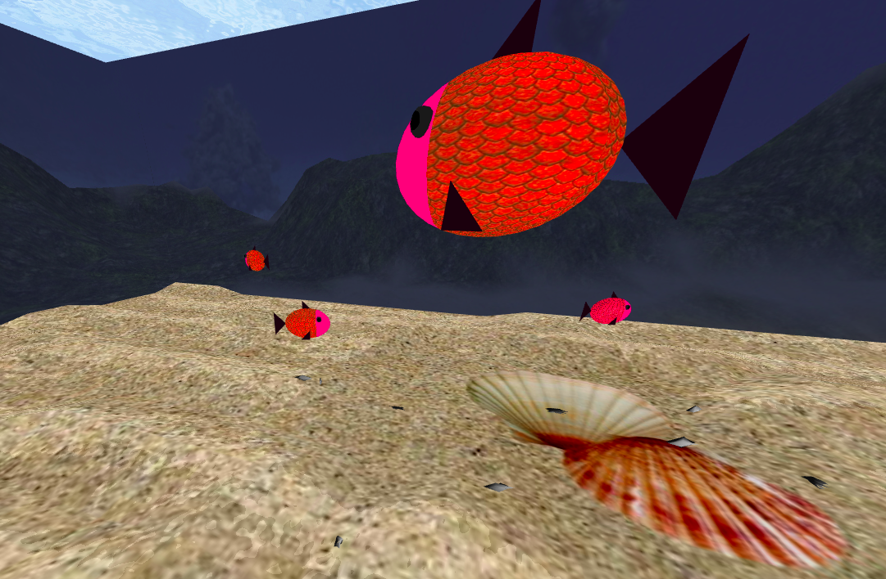

# CGRA 2020/2021

## Group T02G12

## Project Notes

The purpose of this CGRA project is to develop our programming and graphic skills. So, we were requested to make an underwater scene, with fish, seaweed, rocks, and many other objects. Besides the objects we were told to create we chose, from a couple of different suggestions, to create 4 fish that move on their own and seaweeds that have random colors, positions and dimentions. Following the steps given by our teachers, we managed to finish this project with dedication and quality. It is possible to see our work on https://paginas.fe.up.pt/~up201906845/mytest/cgra-t02-g12/project/.

Now, here are some printscreens showing our work.

## Screenshots

### 1 - MyFish

### 2 - Sea Floor

### 3 - Water Surface

### 4 - Rocks

### 5 - Pillars

### 6 - Scene

### 7 - Picking Rocks and Droping them on the Nest

### 8 - Seaweeds at random positions and Animated Fish

Project by Carolina Cintra (up201906845) e Domingos Santos (up201906680).
